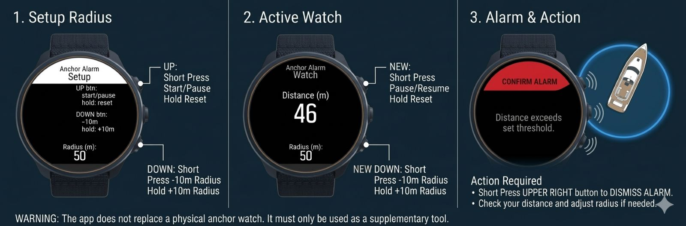

# Anchor Alarm



> Current version: **v0.3** — see [CHANGELOG](CHANGELOG.md)

> **Sleep soundly at anchor.** Anchor Alarm is a SuuntoPlus feature app that continuously monitors your boat's position while you rest, and alerts you the moment the anchor starts to drag.

---

## Why you need it

Anchoring overnight or in changing conditions always carries the risk of anchor drag — the anchor breaks free and the boat silently drifts toward rocks, shallows, or other vessels. Traditional anchor watch means someone stays awake. **Anchor Alarm** turns your Suunto watch into an always-on anchor watch that never falls asleep.

- Set your alarm radius once, start the watch, and go rest.
- The app tracks your distance from the saved anchor position every second using GPS and displays the bearing to the anchor, helping you navigate back if needed.
- The moment you drift beyond the set radius, your watch sounds an alert and shows an alarm screen — so you can react in time.

---

## How it works

When you start a watch, the app saves your current GPS coordinates as the **anchor position**. From that point on, every second it:

1. Reads the current GPS coordinates from the watch sensors.
2. Calculates the distance from the anchor using the **Haversine formula** (great-circle distance, accurate to within a meter at typical anchor radii).
3. Calculates the relative bearing to the anchor using trigonometric calculations (relative to current heading).
4. If the distance exceeds the configured **alarm radius**, triggers an audible alert (`playIndication`) and shows the alarm popup screen.
5. The alarm re-arms automatically once you return within the safe zone, so subsequent breaches are also caught.

GPS accuracy is gated by the `gpsReadiness` sensor — calculations only run when readiness equals 100%, preventing false alarms during GPS acquisition.

The alarm radius is persisted via `localStorage` — the last configured value is restored automatically on next launch.

---

## Screens

### Setup screen (`t_setup.html`)
The entry point of the app. Configure your alarm radius before starting the watch.

| Control | Action |
|---|---|
| UP button | Start watch / Pause / Resume |
| UP hold | Reset watch, return to Setup |
| DOWN button | Decrease alarm radius by 10 m |
| DOWN hold | Increase alarm radius by 10 m |

The current alarm radius is displayed at the bottom of the screen. The minimum radius is 10 m. The last set radius is saved to `localStorage` and restored on next launch.

### Watch screen (`t_watch.html`)
Active monitoring view. Shows real-time distance to the anchor position and the alarm radius for reference.

- **Distance (m)** — current distance to the saved anchor position, updated every second.
- **Bearing (°)** — the direction to the anchor position, shown as a relative bearing; an arrow icon (arrow-a64.png) points towards the anchor.
- **Radius (m)** — the configured alarm threshold, shown as a reminder.
- **Status indicator** — shows `PAUSED` in red when the watch is paused, or `NO GPS` when GPS readiness is below 100%.

Button functions remain the same as on the Setup screen.

### Alarm popup (`t_popup.html`)
Shown automatically when drift exceeds the alarm radius. Uses the `<:dialogTop>` component with a red confirmation button.

| Control | Action |
|---|---|
| UP button (lock) | Confirm and return to Watch screen |

The `type="lock"` attribute on the button requires a deliberate press to prevent accidental dismissal.

---

## File structure

```
AnchorAlarm-for-Suunto/
│
├── ApiZone/
│   ├── DESCRIPTION.md       # SuuntoPlus Store listing description
│   ├── banner_image.png     # Store banner
│   └── screenshot_01.png   # Store screenshot
│
├── assets/
│   └── quickStartGuide.jpg  # Quick-start button reference card
├── arrow-a64.png        # Arrow icon for bearing display
│
├── main.js              # Core application logic
│                          (evaluate, onLoad, onEvent, getUserInterface)
├── data.json            # Default output variable values (alarmRadius seed)
│
├── manifest.json        # App metadata: name, version, input/output resources,
│                          template list, variables block
│
├── t_setup.html         # Setup screen template
├── t_watch.html         # Active watch screen template
├── t_popup.html         # Alarm popup template
│
├── en.json              # Localization: English (source of truth)
├── de.json              #   German
├── fr.json              #   French
├── es.json              #   Spanish
├── it.json              #   Italian
├── nl.json              #   Dutch
├── da.json              #   Danish
├── no.json              #   Norwegian
├── sv.json              #   Swedish
├── pt.json              #   Portuguese
├── fi.json              #   Finnish
├── ru.json              #   Russian
├── pl.json              #   Polish
├── cs.json              #   Czech
├── tr.json              #   Turkish
├── el.json              #   Greek
├── he.json              #   Hebrew
├── th.json              #   Thai
├── zh-Hans.json         #   Chinese (Simplified)
├── zh-Hant.json         #   Chinese (Traditional)
├── ja.json              #   Japanese
├── ko.json              #   Korean
│
├── CHANGELOG.md
├── LICENSE              # MIT License
├── .gitignore
└── README.md
```

### `main.js` — key variables and lifecycle functions

| Symbol | Type | Description |
|---|---|---|
| `templates[]` | array | Template names indexed by `currentScreenIndex` |
| `anchorCoordinates` | object \| null | Saved GPS position at watch start |
| `alarmActive` | bool | Prevents repeated alarm triggers during a single breach |
| `calcDistance` | var/function | Haversine formula, returns distance in meters |
| `computeRelBearing` | var/function | Calculates relative bearing to anchor, returns degrees |
| `loadSettings` | var/function | Reads `alarmRadius` from `localStorage`; called in `onLoad` |
| `evaluate()` | lifecycle | Called ~1 Hz; runs distance/bearing calc and alarm check |
| `onLoad()` | lifecycle | Initializes output variables and restores persisted radius |
| `onEvent()` | lifecycle | Handles button events (IDs 1–6); persists radius on change |
| `getUserInterface()` | lifecycle | Returns current template name |

### `manifest.json` — input/output resources

**Inputs (`in`)**

| Name | Source | Description |
|---|---|---|
| `latitude` | `/Fusion/Location/GeoCoordinates.latitude` | Current GPS latitude |
| `longitude` | `/Fusion/Location/GeoCoordinates.longitude` | Current GPS longitude |
| `gpsReadiness` | `/Fusion/Location/Readiness` | GPS signal quality (0–100) |
| `Heading` | `/Fusion/Compass/Heading` | Compass heading in radians |

**Outputs (`out`)**

| Name | Description |
|---|---|
| `gpsReady` | 1 when GPS readiness = 100%, else 0 (used to gate UP button on Setup screen) |
| `alarmRadius` | Configured alarm radius in meters (persisted via `localStorage`) |
| `watchState` | 0 = idle, 1 = active, 2 = paused |
| `distanceToAnchor` | Current distance to anchor in meters |
| `relBearingToAnchor` | Relative bearing to anchor in degrees |
| `alarmCount` | Number of alarm events during this watch session |

**Variables (`variables`)**

| Path | Shown name | Description |
|---|---|---|
| `alarmRadius` | Alarm radius (m) | Exposed in the SuuntoPlus variables panel |

---

## Platform

- **Device**: Suunto watches with SuuntoPlus support
- **App type**: SuuntoPlus feature app (`"type": "feature"`, `"usage": "workout"`)
- **Language**: Restricted JavaScript — top-level `function` declarations are reserved for lifecycle callbacks; helper functions must use `var name = function(...)` syntax
- **Templates**: Suunto HTML DSL (`<uiView>`, `<userInput>`, `<pushButton>`, `<eval>`, `<:dialogTop>`)
- **Localization**: 22 languages via `{{key}}` substitution compiled by SuuntoPlus Editor

---

## License

MIT License — see [LICENSE](LICENSE).  
Copyright © 2026 Alexander Yamshanov
